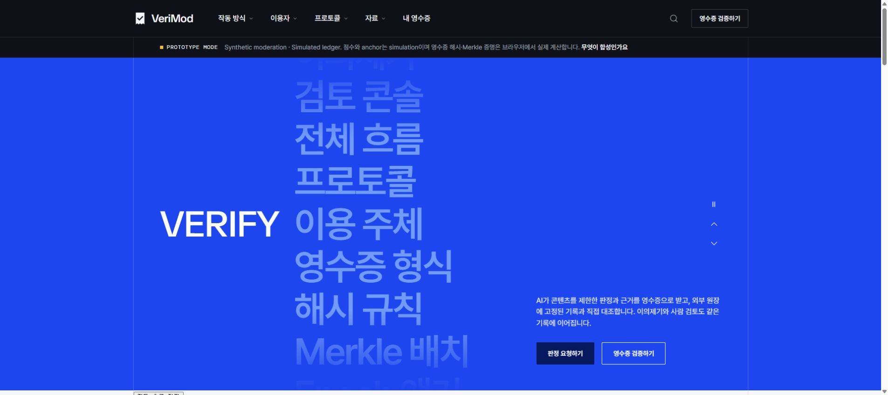
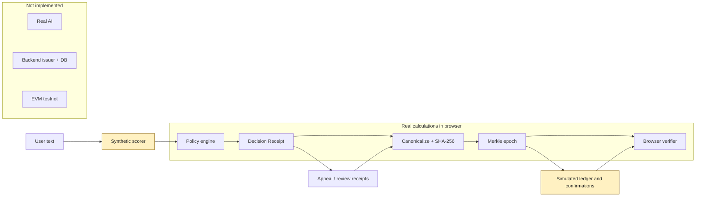

# VeriMod

**User-Verifiable AI Moderation Protocol · HTTP 451 · BLOCK AI 2026**
**Decide. Prove. Appeal.**

[](https://github.com/jujinho03/verimod/actions/workflows/ci.yml?query=branch%3Amain)

콘텐츠 판정 기록을 **Decision Receipt**로 받고, 해시·Merkle proof를 직접 재계산해 기준 root 대비 사후 변경을 확인하고 이의제기 이력을 추적합니다.

> **현재: browser-based synthetic protocol PoC.** SHA-256·Merkle 계산과 검증은 실제 수행합니다. **Synthetic moderation / simulated ledger**이며 실제 AI 모델·업무 backend·EVM testnet은 아직 없습니다. 외부 blockchain commitment는 후속 통합 목표입니다.

## Demo

Node **24.19.0** / npm **12.0.2**. Backend·wallet·RPC key 없이 실행합니다. 공개 hosted demo는 아직 없습니다.

```bash
git clone https://github.com/jujinho03/verimod.git
cd verimod/frontend
npm ci
npm run dev
```

터미널의 localhost 주소를 엽니다(기본 `http://localhost:5173`). Web Crypto에는 localhost 또는 HTTPS가 필요합니다.

[3분 실행 안내](docs/08-submission-guide.md) · [정상/변조 JSON 예제](docs/examples/README.md)

<details>
<summary>실제 실행 화면 — 2026-09-14</summary>



[판정 화면](docs/assets/p0-check-2026-09-13.jpg) · [변조 실패](docs/assets/p0-tamper-2026-09-13.jpg)는 2026-09-13 당시 실제 실행 기록입니다.

</details>

## How it works



Verifier는 **schema → hash → trust config → epoch metadata → inclusion → finality**를 확인합니다. 현재 root는 같은 브라우저의 합성 원장에 있습니다. 서버 응답과 독립적인 실제 chain 조회는 미구현입니다.

## Verification demo

`/verify`에서 공개 JSON 3개를 차례로 검증합니다.

**VALID → 점수 변조 → HASH_MISMATCH → 해시까지 재계산 → INVALID_PROOF**

정상 예제에서 **RPC 장애 가정**을 켜면 `RPC_UNAVAILABLE`입니다. 가용성 실패를 변조와 구분합니다. `/check`에서 새 제한 판정을 발급한 뒤 appeal → `/review`를 진행하면 DECISION/APPEAL/REVIEW 이력이 연결됩니다.

근거: [실제 공개 파일 회귀 검사](frontend/src/domain/submission.test.ts), [독립 Merkle reference·고정 seed 검사](frontend/src/domain/hardening.test.ts), [verifier 구현](frontend/src/domain/verify.ts).

## Current implementation

| 영역 | 상태 / 범위 |
|---|---|
| Canonical / SHA-256 / Merkle / tamper detection | **REAL_IMPLEMENTED** — 제한형 JSON, RFC 8785 전체 구현 아님 |
| 발급·조회·appeal/review UX | **SYNTHETIC_POC** — browser lifecycle |
| Moderation / anchor | **SYNTHETIC_POC** — UNCALIBRATED keyword scores, chain 31337 simulation |
| Backend / contracts | **SCAFFOLD_ONLY** — GET /api/health, ToolchainCheck |
| 실제 AI·모델 평가·업무 API·DB·epoch contract·testnet | **NOT_IMPLEMENTED** |

고정 seed는 동일 hash/root를 재현합니다. 새 발급의 UUID·시각·salt는 새 값입니다. Bundle을 다른 브라우저로 옮겨도 기존 로컬 원장까지 전달되지는 않습니다.

## Code map

| 경로 | 역할 |
|---|---|
| [domain/](frontend/src/domain) | pure protocol 계산·schema·verifier, synthetic scorer |
| [store/](frontend/src/store) | browser state·localStorage·simulated ledger |
| [pages/](frontend/src/pages), [features/](frontend/src/features) | routes와 재사용 UX |
| [backend/](backend/README.md), [contracts/](backend/contracts/README.md) | health / toolchain scaffold |

Routes: `/`, `/check`, `/receipts`, `/receipts/:receiptId`, `/verify`, `/review`, `/protocol`.

## Tests

각 폴더의 lockfile을 사용합니다. 저장소 root에서 **`node scripts/check-all.mjs`** 한 명령으로 아래 설치·검사를 순서대로 실행합니다. 첫 실패에서 중단합니다. 개별 실행:

```bash
npm --prefix frontend ci
npm --prefix frontend test
npm --prefix frontend run lint
npm --prefix frontend run build
npm --prefix backend ci
npm --prefix backend test
npm --prefix backend run typecheck
npm --prefix backend run build
npm --prefix backend/contracts ci
npm --prefix backend/contracts test
npm --prefix backend/contracts run build
```

[실행 결과·위험별 테스트 표](docs/07-validation-2026-09-13.md)는 unit/exhaustive/integration/fixture 검사와 아직 없는 UI·browser E2E 계층을 구분합니다. CI 통과는 production 보안 인증이나 실제 체인 배포가 아닙니다.

## Security boundary

- 원문·salt·appeal 본문은 공개 bundle에서 제외하지만 **localStorage에 평문 저장**합니다. XSS·같은 origin script에 노출될 수 있는 PoC 편의 저장입니다.
- `HUMAN_REVIEWER`는 **인증된 사람의 검토 증명이 아닙니다**.
- Hash/proof 일치는 **AI 정확성·공정성·실제 모델 실행·전체 moderation 기록의 완전성**을 증명하지 않습니다.
- 합성 root까지 함께 바꾸는 공격을 막을 외부 불변 기준점은 없습니다. Core `VALID`와 manifest/content/lifecycle 결과는 별도로 읽습니다.

[Protocol·privacy 감사와 잔여 한계](docs/05-protocol-audit.md)

## Docs and next steps

[문서 안내](docs/README.md)에서 현재 상태·검증·초안·과거 기록을 구분합니다. [P1 backlog](docs/06-p1-backlog.md): public demo → browser E2E·coverage → backend 통합 전 shared protocol → 실제 backend·AI·epoch contract/testnet. 현재 core 위치와 정상 bytes는 유지합니다.
