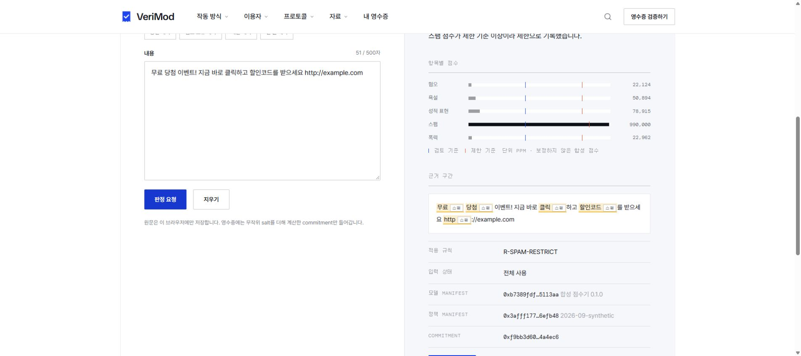

# VeriMod

**User-Verifiable AI Moderation Protocol**

HTTP 451 · BLOCK AI 2026 · AI + 블록체인 융합 서비스

**Decide. Prove. Appeal.**

AI 콘텐츠 moderation 판정을 Decision Receipt로 발급하고, Merkle proof와 외부 blockchain commitment를 통해 이용자가 판정 기록의 사후 변경 여부를 직접 검증하고 이의제기 이력을 추적할 수 있도록 하는 protocol.

**현재는 frontend synthetic protocol PoC입니다.** Receipt 생성, 실제 SHA-256·Merkle 계산, 포함 검증, 사본 변조 탐지와 appeal/review 흐름을 실행할 수 있습니다. Moderation score와 ledger/anchor는 simulation이며 실제 AI·업무 backend·EVM testnet은 후속 구현 대상입니다.

[](https://github.com/jujinho03/verimod/actions/workflows/ci.yml?query=branch%3Amain)

**바로 확인하기:** [심사위원용 실행 안내](docs/08-submission-guide.md) · [정상/변조 JSON 예제](docs/examples/README.md) · [실제 검증 기록](docs/07-validation-2026-09-13.md) · [실제 화면](docs/assets/p0-home-2026-09-13.jpg)

| 현재 직접 확인할 수 있는 것 | 확인 방법 |
|---|---|
| 영수증 발급·Merkle 포함 검증 | 로컬 실행 → `/check` → `/verify` |
| 사후 변경 탐지 | 공개 JSON 3개 → `VALID` / `HASH_MISMATCH` / `INVALID_PROOF` |
| 이의제기·검토 기록 연결 | `/receipts`의 seed 이력 또는 새 발급 → `/review` |
| 재현 가능한 검사 | 위 CI badge와 [테스트 명령](#8-test-commands) |

## 1. Why VeriMod

판정 알림만으로는 당시 판정·모델·정책 기록이 나중에 바뀌었는지 이용자가 확인하기 어렵습니다. 이용자가 받은 receipt를 직접 재계산하고 외부 commitment와 대조하는 구조를 목표로 합니다. 현재 브라우저 원장은 외부 신뢰 기준점의 역할을 시뮬레이션합니다.

## 2. 핵심 사용자 흐름

1. `/check`에서 한국어 문장을 입력하고 synthetic 점수·정책 조치를 확인합니다.
2. 영수증을 발급하고 약 6초 배치 창과 합성 블록 확인을 기다립니다.
3. 상세 화면에서 해시·Merkle 포함 증명을 검증합니다.
4. 사본 점수를 바꾸면 `HASH_MISMATCH`, 해시까지 다시 쓰면 원래 root 기준 `INVALID_PROOF`를 확인합니다.
5. 새 RESTRICT 판정에 이의제기를 제출하고 `/review`에서 검토 결과를 추가합니다. 원본은 덮어쓰지 않습니다.

고정 seed 5건은 초기화 후 같은 receipt hash와 root를 재현합니다. 새 발급은 UUID·시각·salt가 달라집니다. JSON bundle만 다른 브라우저로 가져오면 원래 **로컬 합성 원장**까지 전달되는 것은 아닙니다.

## 3. 현재 구현 상태

검증한 제품 코드: `bee347f00f1795d47063aac281411195ee322346` (P0 보강). 제출용 자료는 main을 기준으로 제공하며 반영 이력은 [PR #1](https://github.com/jujinho03/verimod/pull/1)에서 확인할 수 있습니다. [실제 검증 기록](docs/07-validation-2026-09-13.md)은 코드 존재와 실행 성공을 구분합니다.

| 기능 | 상태 | 범위 |
|---|---|---|
| Frontend interaction / receipt generation | SYNTHETIC_POC | 브라우저 발급·조회·내보내기 |
| Restricted canonical hashing | REAL_IMPLEMENTED | 제한형 JSON + Web Crypto SHA-256; RFC 8785 전체 구현 아님 |
| Merkle proof / tamper detection | REAL_IMPLEMENTED | ordered CT 계산·재검증; 외부 체인 보장 없음 |
| Appeal / review lifecycle | SYNTHETIC_POC | 연결 receipt·대기열; 인증된 사람 검토 아님 |
| Moderation model | SYNTHETIC_POC | synthetic-keyword-match, UNCALIBRATED scores_ppm |
| Blockchain anchor | SYNTHETIC_POC | chain_id 31337, 주소·tx·block·confirmations 합성 |
| Backend / contract toolchain | SCAFFOLD_ONLY | GET /api/health, ToolchainCheck.sol |
| Backend issuance / persistence | NOT_IMPLEMENTED | 업무 API·DB 없음 |
| VeriMod epoch contract / EVM testnet | NOT_IMPLEMENTED | 배포·실제 tx 없음 |
| Model evaluation / calibration | NOT_IMPLEMENTED | 성능 수치 없음 |

## 4. What is real / What is simulated

해시와 Merkle proof는 브라우저가 실제 계산합니다. 점수는 키워드와 deterministic noise를 이용한 합성 값이며 확률·학습된 모델의 출력이 아닙니다. 원장은 같은 브라우저의 상태를 읽습니다. `HUMAN_REVIEWER` 문자열도 실제 사람의 신원·권한·행위를 증명하지 않습니다.

## 5. Architecture

```text
현재 브라우저: text → synthetic scorer → policy → Decision Receipt
                                              ↓ SHA-256
                   local simulated ledger ← Merkle epoch
                                              ↓ bundle
browser verifier: schema → hash → trust → epoch → proof → finality
별도 확인: manifest / private content / lifecycle

P1 목표: 공통 protocol + authoritative backend + private persistence
         + 실제 model evaluation/inference + EVM commitment + independent chain reader
```

core `VALID`와 별도 확인 결과는 따로 읽어야 합니다. RPC 오류는 변조가 아닌 `RPC_UNAVAILABLE`, 미확정은 `PENDING_ANCHOR`입니다.

실제로 실행한 Chrome 화면 (2026-09-13):



[홈 화면](docs/assets/p0-home-2026-09-13.jpg) · [실제 사본 변조 실패](docs/assets/p0-tamper-2026-09-13.jpg)

## 6. Demo routes

| 경로 | 기능 |
|---|---|
| `/` | 개요·보장 범위 |
| `/check` | synthetic 판정·발급 |
| `/receipts` | 목록·고정 seed 초기화 |
| `/receipts/:receiptId` | 상세·proof·변조·appeal |
| `/verify` | bundle 검증·합성 RPC 장애 |
| `/review` | 인증 없는 prototype 검토 콘솔 |
| `/protocol` | 현재 규칙·simulation·후속 통합 |

## 7. Local run

검증 환경은 Node **24.19.0**, npm **12.0.2**, Windows 및 GitHub Actions Ubuntu입니다. 세 디렉터리의 lockfile을 각각 사용합니다. 일반 Node/npm 설치 환경에서:

```bash
git clone --branch main https://github.com/jujinho03/verimod.git
cd verimod/frontend
npm ci
npm run dev
```

Vite 기본 주소는 `http://localhost:5173`입니다. Web Crypto를 위해 localhost 또는 HTTPS가 필요합니다. 현재 PoC는 backend 없이 동작합니다. Health 서버가 필요하면 별도 터미널에서:

```bash
cd backend
npm ci
npm run dev
```

## 8. Test commands

```bash
cd frontend
npm ci
npm test
npm run lint
npm run build

cd ../backend
npm ci
npm test
npm run typecheck
npm run build

cd contracts
npm ci
npm test
npm run build
```

2026-09-14 로컬 재실행: frontend **101 tests**, backend **1 test**, contracts **1 test** 통과. 필수 lint/typecheck/build도 통과했으며 frontend lint 경고 8개는 남아 있습니다.

결과·경고·미실행 항목은 [검증 기록](docs/07-validation-2026-09-13.md)에 남깁니다. 테스트 통과는 production 보안 감사나 실제 체인 배포를 뜻하지 않습니다.

## 9. Repository structure

```text
frontend/src/domain/    receipt·canonical·hash·Merkle·schema·verifier·synthetic scorer
frontend/src/store/     localStorage·seed·합성 ledger·lifecycle
frontend/src/pages/     라우트 화면
frontend/src/features/  proof·변조·점수·검증 UI
backend/src/           Express health scaffold
backend/contracts/     Hardhat + ToolchainCheck scaffold
docs/                  reference·감사·결정 기록·backlog
```

## 10. Security / privacy boundary

원문·salt·appeal 본문은 공개 bundle 및 원장 레코드에 포함하지 않습니다. **현재는 편의를 위해 localStorage에 평문으로 보관**하며 인증·접근 통제가 없습니다. 같은 origin의 스크립트와 XSS에 노출될 수 있어 production secure storage가 아닙니다. 고정 seed salt는 공개된 합성 예제 전용입니다.

실서비스에는 원문 접근 통제, 보존·삭제 정책, reviewer 인증·권한, publisher 키 관리가 필요합니다. 저장소의 LICENSE는 아직 선택되지 않았으며 임의로 부여하지 않습니다.

## 11. What VeriMod proves

현재 PoC는 body의 해시 일치, 합성 원장 root에 대한 Merkle inclusion, 제공된 선행 receipt의 연결 규칙을 계산으로 확인합니다. 실제 외부 blockchain commitment는 목표 아키텍처이며 현재 보장은 브라우저 simulation 내부로 한정됩니다.

## 12. What VeriMod does NOT prove

AI 정확성·공정성, 실제 모델 실행, 실제 사람 검토, 모든 moderation 사건의 완전성, 시각의 진실성, 운영 보안, 실제 transaction·testnet finality를 증명하지 않습니다. 브라우저 상태와 합성 root를 함께 바꾸는 공격에 대한 외부 불변 기준점도 아직 없습니다.

## 13. Roadmap

P0는 문서 일치·정확성·재현성·검증 증거입니다. 이후 공통 protocol 경계 합의 → backend와 저장 → 데이터 라이선스·라벨·baseline·평가 → 실제 epoch contract → testnet 증빙 → 독립 reader 순으로 진행합니다. [P1 backlog](docs/06-p1-backlog.md)에 채택·완료 조건을 기록합니다. P1 기능은 이번에 구현하지 않습니다.

## 14. Documents

- [심사위원용 실행 안내](docs/08-submission-guide.md), [공개 검증 예제](docs/examples/README.md)
- [Repository audit](docs/00-repository-audit.md): 과거 scaffold 기록과 frontend 추가
- [Domain / interfaces](docs/01-domain-and-interfaces.md), [Decision register](docs/02-decision-register.md)
- [현재 상태·기획서 대조](docs/03-current-status.md), [계약 검토 초안](docs/04-interface-contract-draft.md)
- [Protocol audit](docs/05-protocol-audit.md), [P1 backlog](docs/06-p1-backlog.md), [검증 기록](docs/07-validation-2026-09-13.md)
- [최신 기획서 원본](docs/references/project-proposal-2026-09-12.pptx): 수정하지 않은 reference. 노트·본문 정정 사항은 현재 상태 문서 참고

팀: 주진호(서비스·총괄), 노유신(AI·정책), 설경민(코어·블록체인). 기능 브랜치 → PR → 팀원 리뷰 → main 절차를 유지합니다.
