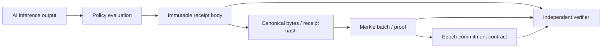

# 도메인 모델과 핵심 인터페이스

프로젝트 공통 맥락은 [MASTER_CONTEXT.md](../MASTER_CONTEXT.md)를 먼저 읽는다. 임시 기획서와의 차이 및 직접 HUMAN_REVIEW 종료 outcome의 보완 필요성은 기준서 9절·16절에 기록되어 있다. 아래 규칙은 확정 ABI나 schema가 아니다.

상태: **PROPOSED — 팀 검토용 v0.1**. 이 문서의 타입·수치 규칙·함수 형태는 설계 제안이다. 실행 코드, 확정 JSON Schema, ABI 또는 검증된 테스트 벡터가 아니다.

2026-09-12 갱신: 제품 코드 `908f64e`에 이 제안을 바탕으로 한 프론트엔드 시험 구현이 추가됐다. [최신 상태](03-current-status.md)와 [계약 검토 초안](04-interface-contract-draft.md)을 함께 읽는다. 최신 14장 기획서는 epoch 등록과 3인 팀을 명시한다. 문서의 규칙은 팀 합의 전 제안이며, 코드 존재가 승인 근거가 되지는 않는다.

## 1. 먼저 고정할 책임 경계

AI adapter는 추론 결과를, policy evaluator는 행동 결정을, receipt builder는 검증 가능한 불변 기록을 생성한다. B는 별도 서비스가 아니라 같은 backend 안의 함수 경계로 충분하다.

| 경계 | 생산자 → 소비자 | 계약 | 소비자가 가정하면 안 되는 것 |
|---|---|---|---|
| I1 | AI adapter → policy evaluator / receipt builder | InferenceOutput + PolicyEvaluation | 모든 모델이 같은 라벨을 지원함, 점수가 calibration됨 |
| I2 | Receipt builder → hasher / 사용자 | 버전이 있는 ReceiptBody | DB의 현재 상태가 과거 receipt와 같음 |
| I3 | Hasher / batcher → verifier | Canonical bytes, receipt hash, ordered inclusion proof | 임의 라이브러리 기본 leaf 규칙이 동일함 |
| I4 | Batcher → contract → verifier | Epoch commitment 및 신뢰할 chain/contract 주소 | 서버가 보내준 root가 실제 온체인 root임 |

모델이나 웹 프레임워크를 바꿔도 I1~I4를 유지하면 나머지 계층 변경을 줄일 수 있다. 완전히 불변인 아키텍처를 보장하는 설계는 아니다.

## 2. 도메인과 수명주기

| 객체 | 책임과 주요 관계 |
|---|---|
| PrivateContent | 원문과 접근권한, content salt를 오프체인 보관. 무작위 내부 ID 사용 |
| ModelManifest | 실제 weights·tokenizer·전처리·추론 설정·label taxonomy·calibration artifact를 식별 |
| PolicyManifest | 라벨→정책 연결, 점수 임계값, 경계 비교, 오류/길이 제한 처리, 조치 규칙 |
| InferenceOutput | 어떤 추론 파이프라인이 어떤 입력 commitment에 점수를 냈다고 기록했는지 |
| PolicyEvaluation | 해당 점수에 특정 정책을 적용한 조치와 구조화된 이유 |
| ReceiptBody | event_kind에 따라 decision / appeal / review를 표현하는 불변 객체 |
| Epoch | 한 issuer의 동결된 ordered receipt 목록 및 root |
| VerificationBundle | receipt + inclusion proof + anchor locator. receipt 본문과 분리 |

최소 수명주기 제안:

- DECISION: 최초 자동 판정. action은 ALLOW / RESTRICT / HUMAN_REVIEW.
- APPEAL: 기존 DECISION에 대한 이용자의 이의제기 접수. 기존 action을 덮어쓰지 않는다.
- REVIEW: APPEAL 또는 HUMAN_REVIEW 판정에 대한 사람 검토. 시험 구현은 appeal에 UPHOLD / OVERTURN, 직접 HUMAN_REVIEW 종료에 RESOLVED를 사용한다. resulting_action은 ALLOW / RESTRICT다. RESOLVED와 전이 제한의 정식 채택은 [C02](04-interface-contract-draft.md)에서 검토한다.
- RESTORE는 이전 RESTRICT가 REVIEW에서 ALLOW로 바뀔 때의 UI 표현이며 새로운 정책 action으로 섞지 않는다.
- MVP는 최초 판정당 한 개의 열린 appeal과 한 개의 최종 review를 제안한다. 재심은 후속 확장으로 남긴다.
- hash 연결은 기록 연결만 증명한다. 실제 사용자 권한, reviewer 자격, 중복 요청·동시 처리 통제는 backend 책임이다.

## 3. I1 — AI moderation output

최초 대상은 한국어 텍스트 분류다. label taxonomy는 데이터셋 라이선스·라벨을 확인한 뒤 확정한다. hate/violence/sexual/spam 전체를 미리 강제하지 않는다.

InferenceOutput 필드 제안:

| 필드 | 타입 / 규칙 |
|---|---|
| output_version | 고정 버전 문자열 |
| inference_id | 무작위 UUID v4, 소문자 표준 표현 |
| content_commitment | 아래 content commitment, 입력과 결과를 묶음 |
| model_manifest_hash | SHA-256 32 bytes의 소문자 `0x` hex |
| taxonomy_id / taxonomy_version | scores 키 집합과 의미를 고정 |
| scores_ppm | label_id → 0~1,000,000 정수. multi-label이며 합 1,000,000을 요구하지 않음 |
| score_semantics | UNCALIBRATED / CALIBRATED. manifest에 calibration 방식 또는 none 명시 |
| input_status | FULL / TRUNCATED. 전처리·토큰 제한·truncation 방식은 manifest가 정의 |
| evidence | 선택적 span 메타데이터 배열. 없으면 빈 배열 |
| inferred_at | UTC 시간 문자열 |

확률 p를 전달용 정수로 변환하는 제안은 floor(p × 1,000,000 + 0.5)다. p가 유한한 [0,1] 실수인지 먼저 검사하며, 이후 정책 결정은 전달된 정수만 사용한다. 생산자에서 한 번 변환하고 소비자가 다시 반올림하지 않는다. UI의 소수점 표시를 hash 입력으로 재사용하지 않는다.

PolicyEvaluation은 policy_manifest_hash, action, reason_codes, triggered_rule_ids를 가진다. 구조화된 정책 명세를 함께 배포해야 threshold와 결정 경로를 재계산할 수 있다.
제안 규칙은 label별 review_threshold < restrict_threshold를 두고, 어느 라벨이든 restrict_threshold 이상이면 RESTRICT, 그 외 review_threshold 이상이면 HUMAN_REVIEW, 나머지는 ALLOW다. TRUNCATED는 제한 판정에 앞서 HUMAN_REVIEW로 보낸다는 우선순위를 정책에 명시한다. 임계값 수치와 라벨별 적용은 평가 후 결정한다.

timeout, 결측 라벨, NaN, 범위 밖 점수, 입력 오류는 성공한 InferenceOutput이 아니다. typed error로 반환하고 자동 ALLOW나 가짜 점수를 생성하지 않는다. 초기 MVP에서는 오류 화면 및 재시도 대상으로 처리하며, AI 실패 상황의 별도 receipt는 후속 합의 대상으로 둔다.

evidence는 원문 기준 Unicode code point의 반열린 구간 [start,end), label_id, method_id, method_version만 포함한다. JS UTF-16 index 및 tokenizer index에서의 매핑은 adapter 책임이다. 직접 substring, 욕설 원문, 생성 rationale은 receipt에 넣지 않는다. 추출법이 없으면 span을 지어내지 않는다. span도 민감 메타데이터이므로 receipt 접근을 제한한다.

## 4. I2 — Decision Receipt schema

공통 ReceiptBody 필드 제안:

| 필드 | 규칙 |
|---|---|
| protocol_version | `verimod/1`이 시험 코드에 적용됨. 정식 팀 채택은 미확정 |
| receipt_id | 무작위 UUID v4 |
| issuer_id | 공개 플랫폼 식별자. 개인 사용자 ID 금지 |
| event_kind | DECISION / APPEAL / REVIEW |
| recorded_at | 발급자가 주장하는 기록 생성 시각 |
| content_commitment | 같은 수명주기에서 동일 값 사용 |
| subject_receipt_hash | 최초 DECISION은 null. APPEAL/REVIEW는 최초 DECISION hash |
| previous_receipt_hash | 최초 DECISION은 null. APPEAL은 DECISION, REVIEW는 APPEAL 또는 직접 HUMAN_REVIEW DECISION hash |
| payload | event_kind별 엄격한 필드 집합 |

DECISION payload는 InferenceOutput과 PolicyEvaluation을 포함한다. 상위 content_commitment와 추론 출력 commitment의 일치를 필수 검사한다. APPEAL payload는 salted appeal text commitment와 `USER_REQUESTED_REVIEW` 같은 허용 reason code를 포함하고 본문·사용자 계정은 별도 보관한다. REVIEW payload는 outcome, resulting_action, reason_codes, review_policy_manifest_hash, reviewer_role=`HUMAN_REVIEWER`를 포함한다. reviewer 개인정보는 넣지 않는다. outcome은 최초 action과 resulting_action의 관계에 맞아야 한다.

Receipt에는 자기 자신의 hash, Merkle proof, epoch_id, tx_hash, block_number, confirmations, verified 상태, mutable DB status를 넣지 않는다. 앵커가 생성된 뒤 이를 붙여 원본 hash가 바뀌는 순환 의존성을 막는다.

VerificationBundle은 receipt_body, receipt_hash, proof, anchor를 담는 별도 전달 구조다. 최초에는 proof/anchor가 null인 PENDING 상태이고, 앵커 후 bundle만 확장한다. 영수증 hash는 항상 body에서 재계산한다.

### 공통 데이터 표현

- UTC 시각: 정확히 `YYYY-MM-DDTHH:mm:ss.SSSZ`. 정상 달력 날짜를 검증하고 윤초는 거부한다. 발급 전에 정규화하며, verifier는 저장된 시각을 고쳐 hash하지 않는다.
- JSON 숫자는 안전 정수 범위 내 정수만 허용한다. 큰 uint64/uint256, chain_id, epoch_id는 선행 0 없는 10진 문자열로 전달한다.
- hash는 `0x` + 소문자 hex 64자, EVM 주소는 `0x` + 소문자 hex 40자. hash 결합에서는 hex 문자가 아니라 decode된 bytes를 사용한다.
- 누락/null/빈 배열을 동등하게 처리하지 않는다. 명세상 null인 필드는 명시적으로 null, evidence는 빈 배열을 허용한다.
- 미지 필드, 중복 JSON 키, 잘못된 Unicode, 비유한 수는 거부한다. 미지원 protocol_version도 거부한다.
- label과 reason 등 집합 성격 배열은 중복 금지·ASCII ID 오름차순. evidence는 start, end, label_id, method_id, method_version 순 정렬 및 완전 중복 금지. proof 배열은 경로 순서를 보존한다.

### Manifest와 content commitment

model hash는 모델명 문자열의 hash가 아니다. 공개 가능한 manifest에 artifact 상대 경로·각 파일 SHA-256·정확한 revision·전처리/토크나이저/추론 설정·라벨 정의·calibration 상태를 넣고 파일 목록을 경로 순 정렬한다. 비공개 로컬 경로와 credentials는 제외한다. 모델 또는 calibration 변경은 새 manifest hash를 만든다. 실제 artifact를 검증하기 전 임시 값을 진짜 model hash로 표시하지 않는다.

policy manifest는 version label과 함께 라벨 매핑·정수 threshold·비교 연산·우선순위·길이 처리·reason code 의미를 포함한다. 버전 문자열만 유지한 채 내용을 바꾸면 hash가 달라진다. inference 및 review 정책은 서로 다른 manifest를 참조할 수 있다.

content_commitment 제안은 SHA256(ASCII `verimod:content:v1` + 0x00 + salt32 + UTF8(original_text))다. salt32는 CSPRNG 32 bytes이며 receipt와 온체인에는 공개하지 않는다. salt와 원문은 본인 검증용 별도 접근 제어 경로로 전달한다. 같은 콘텐츠 수명주기는 salt를 유지하고 새로운 제출은 새 salt를 사용한다. 원문은 trim/Unicode 정규화 없이 입력 그대로이며, 모델 전처리는 manifest에 별도 정의한다.

appeal text도 독립 salt와 `verimod:appeal:v1` 도메인으로 commitment를 만든다. salt를 모르는 공개 관찰자의 짧은 원문 사전 대입을 어렵게 하지만 접근 권한자가 받은 정보까지 숨기지는 못한다. salt 유실 시 content 연결 재검증이 불가능해도 receipt inclusion 검증은 가능하다.

## 5. I3 — Canonicalization / hash / Merkle

제안: RFC 8785 JCS 계열 결정적 직렬화로 ReceiptBody의 canonical UTF-8 bytes를 만든다. 현재 `canonical.ts`는 안전 정수 등 제한된 값만 처리하며 RFC 8785 전체 호환을 주장하지 않는다. 정식 JCS 라이브러리 채택 또는 제한 프로파일 명세화를 C04에서 결정한다. Unicode 문자열을 hash 과정에서 임의 정규화하지 않는다. Node 백엔드와 브라우저의 공통 벡터를 우선 비교하며, Python도 직렬화/hash에 참여할 때 Python 비교를 추가한다. [RFC 8785](https://www.rfc-editor.org/rfc/rfc8785)

VeriMod 고유 hash domain 제안:

| 대상 | SHA-256 입력 bytes |
|---|---|
| receipt_hash | ASCII `verimod:receipt:v1` + 0x00 + JCS(ReceiptBody) |
| model_manifest_hash | ASCII `verimod:model:v1` + 0x00 + JCS(ModelManifest) |
| policy_manifest_hash | ASCII `verimod:policy:v1` + 0x00 + JCS(PolicyManifest) |
| issuer_commitment | ASCII `verimod:issuer:v1` + 0x00 + UTF8(issuer_id) |

0x00은 단일 zero byte다. SHA-256을 제안하는 이유는 Python·브라우저의 지원과 CT 방식의 재사용이며, EVM 전용 Keccak을 쓰지 않아도 root를 bytes32로 기록할 수 있기 때문이다. Solidity도 SHA-256 함수를 제공한다. SHA3-256과 Keccak-256을 섞는 사양은 사용하지 않는다. [Solidity 공식 문서](https://docs.soliditylang.org/en/latest/units-and-global-variables.html#mathematical-and-cryptographic-functions)

각 epoch는 receipt_id ASCII 오름차순으로 동결한 목록이다. receipt_id와 receipt_hash 중복을 거부한다. tree entry는 receipt_hash의 raw 32 bytes이며, leaf=SHA256(0x00 + entry), internal=SHA256(0x01 + left32 + right32)다. ordered tree의 분할·inclusion path는 RFC 9162 §2.1 방식을 따른다. 홀수 leaf를 복제하거나 pair를 정렬하지 않는다. 단일 leaf root는 leaf 자체, proof는 빈 배열이며 빈 epoch는 커밋하지 않는다. [RFC 9162 §2.1](https://www.rfc-editor.org/rfc/rfc9162.html#section-2.1)

이것은 CT의 Merkle 구성을 사용하는 독립 epoch batching이다. CT 전체 프로토콜 구현이나 epoch 간 consistency proof를 제공한다는 주장은 하지 않는다.

Proof 필드: merkle_spec=`ct-sha256-receipt-v1`, leaf_index(0-based), tree_size, siblings(leaf→root 순서의 32-byte hash 목록). tree_size는 온체인 receipt_count와 같아야 한다. index 범위·경로 길이·남는 sibling·누락 sibling을 검사한다. root만 맞춰 보는 느슨한 검증은 금지한다. 임의 Merkle 라이브러리의 sorted-pair/double-hash 기본값은 이 명세와 호환된다고 가정하지 않는다.

batch 동결 후 root와 receipt 목록을 변경하지 않는다. 새 receipt는 다음 epoch로 보낸다. receipt_count는 발급자의 포함 목록 길이이며 전체 moderation event 수를 증명하지 않는다. contract는 목록 자체를 보지 못하므로 count의 진실성도 독립 검증하지 못한다.

## 6. I4 — Smart Contract epoch commitment

MVP 제안: 플랫폼 하나당 단순한 non-upgradeable contract 하나. 배포 시 허용 publisher와 issuer_commitment를 고정하고, 사용자 wallet 없이 읽기 검증한다. 체인은 EVM testnet 후보를 유지한다.

논리적 쓰기 인터페이스는 registerEpoch(epoch_id:uint64, root:bytes32, receipt_count:uint32, protocol_version:uint32)다. protocol_version=1이 위 receipt/hash/Merkle 조합 전체에 대응하도록 고정한다. 이름과 실제 ABI는 구현 진입 전에 확정한다.

| 필드 / 동작 | 책임 |
|---|---|
| epoch_id | 1부터 증가. last_epoch_id+1만 허용하는 제안 |
| root | 0이 아닌 bytes32 |
| receipt_count | 1 이상 uint32. 서비스 상한은 별도 설정 |
| protocol_version | MVP는 지원하는 1만 허용 |
| publisher / issuer_commitment | 배포 시 고정된 발급 주체. 임의 호출자 등록 거부 |
| anchored_at / anchored_block | contract가 block.timestamp / block.number로 기록 |
| getEpoch | 존재 여부를 명시하여 미등록과 0-filled 결과를 구분 |
| EpochRegistered event | epoch_id, root, count, version, publisher 및 block 문맥 확인용 |

중복 epoch, unauthorized 등록, 기존 값 수정·삭제는 허용하지 않는다. update/delete 함수와 proxy를 두지 않는다. 키 손실 시 새로운 배포 및 verifier 신뢰 목록 변경이 필요하다는 MVP 운영 제약을 인정한다.

한 epoch에 서로 다른 model/policy version의 receipt를 허용한다. 따라서 epoch에 단일 model_version/policy_version을 대표값으로 적지 않는다. 각 receipt 안의 manifest hash가 root를 통해 묶인다. 독립적인 model registry는 MVP 필수가 아니다.

Anchor locator는 chain_id, contract_address, epoch_id, tx_hash, block_number, block_hash를 포함한다. locator 자체는 신뢰 근거가 아니다. verifier는 사전 신뢰 설정에 있는 chain/contract/issuer와 지원 protocol을 사용하고, 사용자가 제공한 임의 contract의 root를 성공으로 받아들이지 않는다.

앵커 상태는 PENDING → SUBMITTED → CONFIRMING → ANCHORED로 구분한다. RPC 오류는 실패 원인과 함께 UNKNOWN, tx revert는 FAILED로 처리한다. reorg가 확인되면 ANCHORED를 철회하고 재확인한다. 체인별 finality 기준과 RPC 선택은 배포 전 결정한다. retry 시 같은 epoch 상태를 먼저 조회하고 동일 root/count/version이면 성공으로 처리하며 다른 값이면 충돌이다. 미확정 tx 때문에 새 epoch를 중복 발급하지 않는다.

## 7. 이용자 검증과 보장 범위

검증기는 schema/version 검증 → receipt hash 재계산 → 신뢰한 chain/contract에서 epoch 조회 → issuer/protocol/count 확인 → Merkle inclusion 검증 → confirmation/finality 확인 순서로 판정한다. 서버의 `/verify` 응답에만 의존하지 않는 브라우저 또는 독립 검증기를 목표로 한다. RPC 응답은 full/light client 검증 없이 완전 무신뢰가 아니며, RPC 공급자 신뢰를 별도 명시한다.

결과는 VALID, INVALID_SCHEMA, UNSUPPORTED_VERSION, HASH_MISMATCH, INVALID_PROOF, UNTRUSTED_ANCHOR, PENDING_ANCHOR, RPC_UNAVAILABLE로 구분한다. manifest/content/lifecycle 검증은 각각 PASSED / FAILED / NOT_CHECKED로 별도 표시한다. receipt inclusion이 VALID여도 모델 실행이나 판정 정확성이 증명된 것은 아니다.

Review lifecycle 검증 시 참조 hash의 receipt를 실제로 가져와 각각 inclusion을 검증하고 issuer/content/종류/상태 전이를 확인한다. 선행 기록이 없으면 INCOMPLETE_HISTORY로 보고 완전한 appeal 검증 성공을 표시하지 않는다. 링크는 숨겨진 다른 분기나 누락 event 부재를 증명하지 않는다.

시각에 관한 표현은 “이 commitment가 해당 확정 블록에 포함됐다”로 제한한다. receipt의 inferred_at/recorded_at은 발급자가 주장한 시각이다. batching 대기 중에는 외부 anchor 보장이 없고 최초 발급의 진실성·actual inference attestation·fairness·completeness는 범위 밖이다.

Tamper demo는 보존한 원본 receipt의 복사본에서 score 또는 policy hash를 변경한다. 원본 anchor 기준 HASH_MISMATCH/INVALID_PROOF가 발생해야 한다. RPC 오류를 TAMPERING DETECTED로 표시하지 않는다. 새 root로 재발급한 변경 기록은 새로운 anchor일 뿐, 이용자가 보유한 원래 anchor를 덮어쓴 것으로 취급하지 않는다.

## 8. 협업자 책임

2026-09-19 팀 합의 기준(기획서 10장 분담에서 변경, 02 결정 기록): 주진호는 label taxonomy, 데이터 검토, InferenceOutput 의미, 평가 지표·오탐 분석·threshold, 정책·manifest 내용을 맡고 기획·발표·일정을 총괄한다. 설경민은 receipt schema, canonicalization, Merkle/proof, contract와 독립 verifier를 맡고 backend 구조 설계와 기술 리드를 겸한다. 노유신은 업무 API 구현, 불변 receipt 저장, 인증·원문 접근 통제, 상태 처리와 검증 화면·UI 연결을 맡는다.

공동: schema version, 수치/시간 규칙, 상태 전이, trust boundary, 공개 범위, 실패 사례. 네 인터페이스의 실제 생산자·소비자와 검토 항목은 [계약 초안](04-interface-contract-draft.md)에 정리한다.

## 9. 시험 구현과의 차이

제품 코드 `908f64e`와 2026-09-13 P0 보강 기준이다. 위 제안 명세가 모두 구현된 것은 아니다.

- P0에서 JSON 원본 토큰의 중복 키 검사와 1 MiB/64단계 입력 제한을 추가했다. 이미 parse된 object에서는 원본의 중복 키 여부를 알 수 없다.
- scorer는 evidence를 정렬하지만 schema 검증은 배열 정렬·완전 중복 금지를 검사하지 않는다.
- content side check는 원래 콘텐츠만 재계산하며 별도 appeal 본문 commitment 검사는 없다.
- `LedgerReader`는 시뮬레이션 원장을 조회한다. 실제 RPC chain ID·transaction·block hash·reorg 검증은 미연결이다.
- state/store의 로컬 중복 제한은 서버의 권한·멱등성·동시성 보장을 대체하지 않는다.
- 상세 차이와 후속 검증 항목은 [최신 상태](03-current-status.md), 채택·변경 영향은 [계약 초안](04-interface-contract-draft.md)을 따른다.

프레임워크와 AI 모델을 먼저 정하기보다 이 계약과 아래의 구현 진입 조건을 먼저 합의한다.
